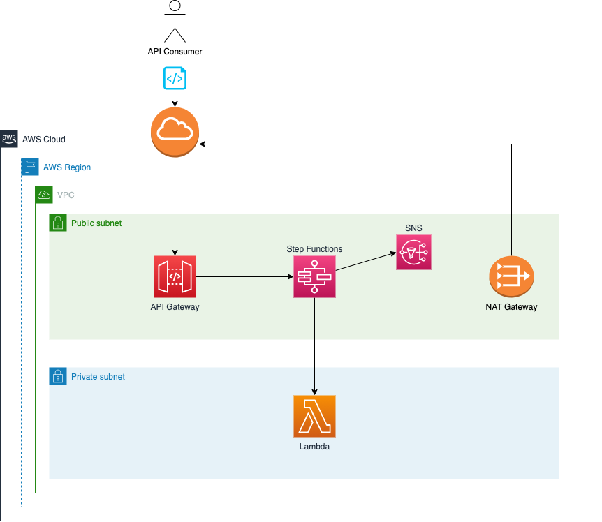
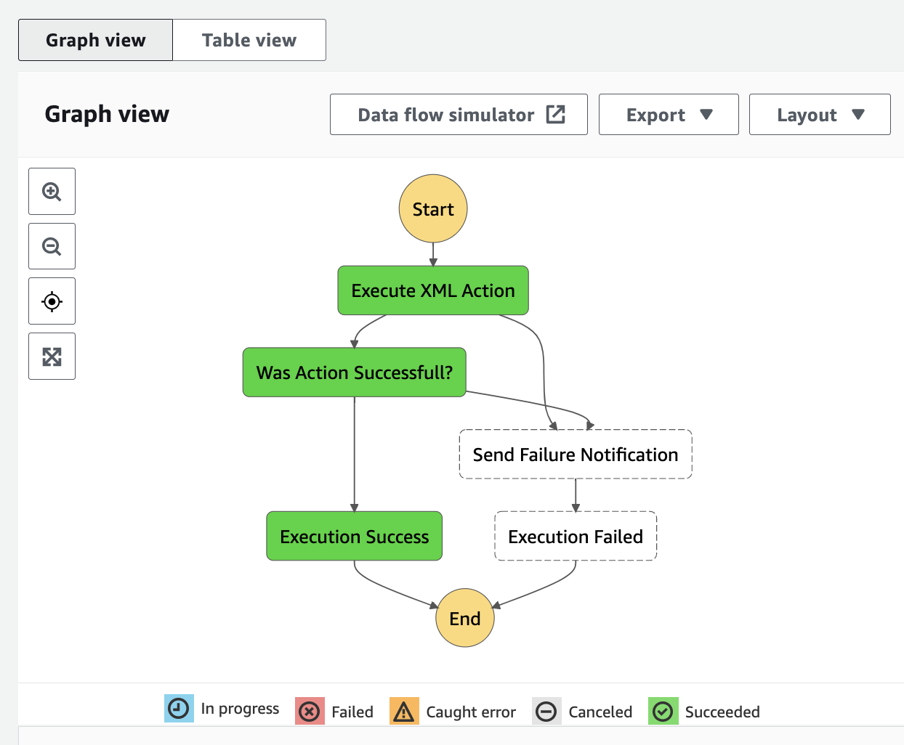
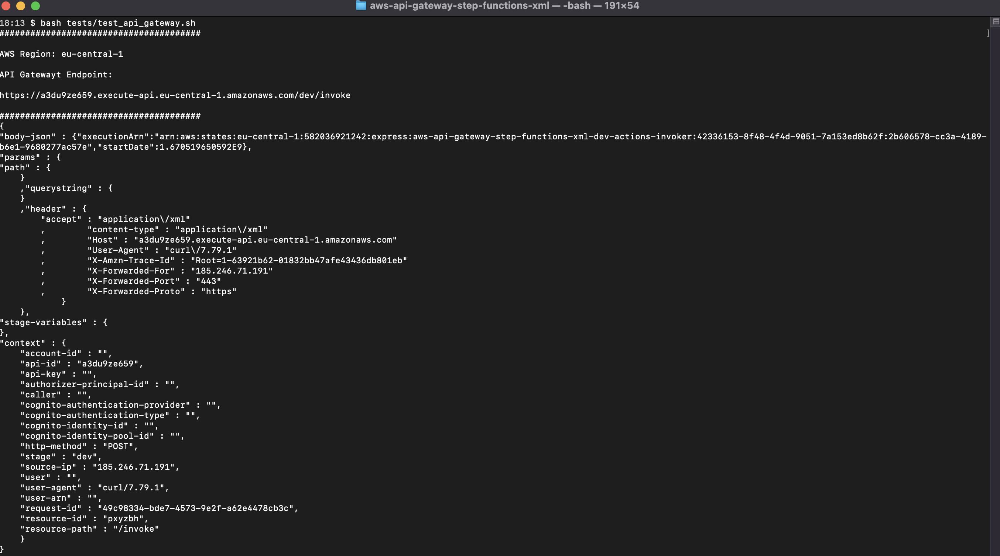
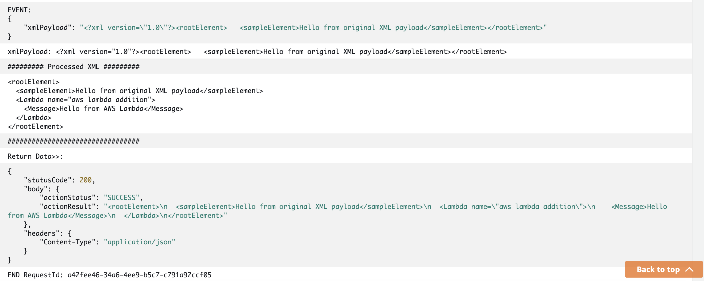

# aws-api-gateway-step-function-xml

[JSON](https://www.json.org/) (Java Object Script Notation) has become the de facto standard as the form of message interchange for web services. We see this reflected in many AWS Services such as [Amazon API Gateway](https://aws.amazon.com/api-gateway/) and [AWS Step Functions](https://aws.amazon.com/step-functions/) which use JSON as the default messaging exchange format.

JSON is not the only messaging exchange format however with many systems still relying on [XML](https://en.wikipedia.org/wiki/XML) (Extensible Markup Language).

This project provides a solution for configuring Amazon API Gateway to work with XML payloads and integrate those XML payloads with other AWS Services such as AWS Step Functions.

The solution is delivered using an [IaC](https://en.wikipedia.org/wiki/Infrastructure_as_code) (Infrastructure as Code) approach with [Terraform](https://www.terraform.io/).

## Table of Contents

* [Solution Architecture](#solution-architecture)
* [Project structure](#project-structure)
* [Terraform state](#terraform-state)
* [Terraform modules](#terraform-modules)
* [Building the AWS Lambda functions](#building-the-aws-lambda-functions)
* [Deploying the solution](#deploying-the-solution)
* [Testing the solution](#testing-the-solution)
* [Destroying the solution](#destroying-the-solution)
* [Terraform Linting](#terraform-linting)
* [IaC Security and Compliance Analysis](#iac-security-and-compliance-analysis)

## Solution Architecture

The solution architecture discussed in this post is presented below:



The core services of the solution architecture are referenced below:

| Core service | Description |
|-----------------|:-------------|
| [API Gateway](https://aws.amazon.com/api-gateway/) | Amazon API Gateway is a fully managed service that makes it easy for developers to create, publish, maintain, monitor, and secure APIs at any scale. APIs act as the "front door" for applications to access data, business logic, or functionality from your backend services. API Gateway is used within this solution to publish the API endpoints, accept an incoming XML payload and integrate that XML payload with other AWS services. |
| [AWS Step Functions](https://aws.amazon.com/step-functions/) | AWS Step Functions is a low-code, visual workflow service that developers use to build distributed applications, automate IT and business processes, and build data and machine learning pipelines using AWS services. Workflows manage failures, retries, parallelization, service integrations, and observability so developers can focus on higher-value business logic. An AWS Step Function is used within this solution as the target integration for the API Gateway. |
| [AWS Lambda](https://aws.amazon.com/lambda/) | AWS Lambda is a serverless, event-driven compute service that lets you run code for virtually any type of application or backend service without provisioning or managing servers. You can trigger Lambda from over 200 AWS services and software as a service (SaaS) applications, and only pay for what you use. AWS Lambda is used within this solution as the compute service that executes an action as part of an AWS Step Functions State Machine workflow. |
| [AWS SNS (Simple Notification Service)](https://aws.amazon.com/sns/) | Amazon Simple Notification Service (Amazon SNS) is a fully managed messaging service for both application-to-application (A2A) and application-to-person (A2P) communication. AWS SNS is used within this solution to publish error notifications for failures during the execution of an AWS Step Functions State Machine workflow. |

The application flow is described below:

1. An API consumer makes a HTTPS call to the [AWS API Gateway](https://aws.amazon.com/api-gateway/) endpoint, via a POST request with an XML payload].
2. The AWS API Gateway receives the request and, through a direct [service integration](https://docs.aws.amazon.com/apigateway/latest/developerguide/http-api-develop-integrations-aws-services.html) with [AWS Step Functions](https://aws.amazon.com/step-functions/), invokes an AWS Step Function to begin processing the request. The XML payload is transformed to JSON and passed to the AWS Step Function as a State Machine input parameter.
3. The AWS Step Function is invoked and it begins the execution of an [AWS State Machine](https://docs.aws.amazon.com/step-functions/latest/dg/amazon-states-language-state-machine-structure.html) which contains various state transitions.
4. The AWS State Machine begins by calling an [AWS Lambda](https://aws.amazon.com/lambda/) function which is written in [C Sharp](https://learn.microsoft.com/en-us/dotnet/csharp/) .Upon completion of the AWS Lambda function, a result is returned to the AWS State Machine.
5. The AWS State Machine evaluates the result. 
    1. If there is a failure in the AWS Lambda function then the AWS State Machine will exit the process, sending an error notification to an [AWS Simple Notification Service](https://aws.amazon.com/sns/) topic.
    2. If the AWS Lambda function has completed successfully, then the AWS State Machine gracefully ends the workflow with a successful outcome.



## Project structure

The project contains the following structure:

```
── docs
├── env
│   └── dev
├── modules
│   ├── api_gateway
│   ├── kms
│   ├── lambda
│   ├── sns
│   ├── step_functions
│   └── vpc
└── tests
```

| Directory | Description |
| ------------- | ------------- |
| `docs` | Project documentation. |
| `env` | Deployment environments. The PoC solution only contains a single `dev` deployment destination. |
| `modules` | Terraform modules that are composed to deliver the PoC solution. |
| `tests` | Solution tests. |

## Terraform state

For the purposes of this project, Terraform state is stored locally.

Although beyond the scope of this project, Terraform can use remote state with an [AWS S3 Backend](https://developer.hashicorp.com/terraform/language/settings/backends/s3) which is a better practice when working in multiple developer environments.

## Terraform modules

The solution uses the following modules from the public Terraform registry.

| Module name | Terraform registry | Github |
| ------------- | ------------- | ----- |
| AWS Lambda | [terraform-aws-modules/lambda/aws](https://registry.terraform.io/modules/terraform-aws-modules/lambda/aws/latest) | [terraform-aws-lambda](https://github.com/terraform-aws-modules/terraform-aws-lambda) |
| AWS Security Group | [terraform-aws-modules/security-group/aws](https://registry.terraform.io/modules/terraform-aws-modules/security-group/aws/latest) | [terraform-aws-security-group](https://github.com/terraform-aws-modules/terraform-aws-security-group) |
| AWS VPC | [terraform-aws-modules/vpc/aws](https://registry.terraform.io/modules/terraform-aws-modules/vpc/aws/latest) | [terraform-aws-vpc](https://github.com/terraform-aws-modules/terraform-aws-vpc) |

## Building the AWS Lambda function

The solution contains a C Sharp Lambda function:

* [Action](modules/lambda/resources/Action/src/Action/Function.cs)

The Lambda function can be built for deployment via the following command:

`bash env/dev/prerequisites/pre_tf_init.sh`

## Deploying the solution

Assuming that you have [configured your AWS CLI environment](https://docs.aws.amazon.com/cli/latest/userguide/cli-configure-quickstart.html) with an account that has sufficient permissions to make a deployment, the solution can be deployed with the command below:

```bash
cd env/dev
terraform init
terraform plan -out tfplan.json
terraform apply tfplan.json
```

The solution is using a [terraform.tfvars](env/dev/terraform.tfvars) file to provide the environment specific variable values. Please adjust the `region` variable value in the [terraform.tfvars](env/dev/terraform.tfvars) file to reflect the AWS region that you wish to deploy into.

# Testing the solution

The solution provide a test script that can be used to test the all the components of the deployment.

The test can be executed from the root level of the project.

The component test can be found in the [tests](tests) directory.

| Test | Invocation | Description |
| ------------- | ------------- | ----- |
| [API Gateway](tests/test_api_gateway.sh) | `bash tests/test_api_gateway.sh` | Simulates an API consumer and sends an XML payload to the API Gateway public endpoint. This is an End to End test which tests all components of the solution. |

An example of the test script execution is shown below:



The Cloudwatch Logs for the project's AWS Lambda function can also be checked to confirm that the XML payload has been correctly passed through from the API Gateway to the AWS Step Function to the AWS Lambda.

An example Cloudwatch Log Output of the AWS Lambda function is shown below:



# Destroying the solution

The solution can be destroyed via:

```bash
cd env/dev
terraform destroy
```

# Terraform Linting

The project includes [tflint](https://github.com/terraform-linters/tflint).

TFLint is a pluggable Terraform linter framework. The key features are as follows:

* Find possible errors (like invalid instance types) for Major Cloud providers (AWS/Azure/GCP).
* Warn about deprecated syntax, unused declarations.
* Enforce best practices, naming conventions.

TFlint can executed from the script shown below:

`bash generate_report_tflint.sh`

# IaC Security and Compliance Analysis

The project includes [checkov](https://www.checkov.io/).

Checkov scans cloud infrastructure configurations to find misconfigurations before they're deployed.

Checkov uses a common command line interface to manage and analyze infrastructure as code (IaC) scan results across platforms such as Terraform, CloudFormation, Kubernetes, Helm, ARM Templates and Serverless framework.

Checkov can be executed from the script shown below:

`bash generate_report_checkov.sh`

*NOTE:* Checkov will generate findings for this project. Addressing these findings is beyond the scope of this project however Checkov findings should be analyzed and remediated in production systems.